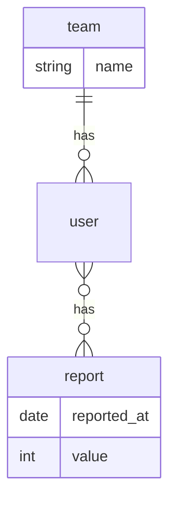

```mermaid
---
Data models
---

erDiagram
    
    team {
        string  name
    }
    
    report {
        date    reported_at
        int     value
    }
    
    user }o--o{ report : has
    team ||--o{ user : has

```
